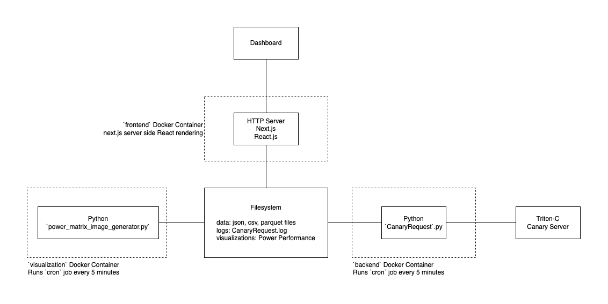

# Oscilla Power Triton-C Dashboard

## Overview

The [Oscilla Power Triton-C](https://www.oscillapower.com/triton-c) is a prototype 100 kW Wave Energy Converter (WEC) planned to deploy at the [U.S. Navy Wave Energy Test Site (WETS)](https://tethys.pnnl.gov/project-sites/us-navy-wave-energy-test-site-wets#:~:text=deploying%20at%20WETS.-,Location,'ahu%2C%20Hawai'i.) sometime in 2023. In order to better understand the power performance of the WEC, NREL is building a dashboard to visualize power performance and wave conditions for the duration of the device deployment. Onboard the WEC is some type of data acquisition system that saves data using [Canary Labs](https://www.canarylabs.com/) software. The code in this repository interfaces with the WEC Canary server, saves data offline, and builds power performance visualizations which are displayed in a web application.

## Architecture



### Frontend

Frontend handles presenting data to the client. Frontend is built with react.js served through next.js. For simplication we request data server side using `getServerSideProps` which pulls stored data files from the local file system.

### Backend

The `CanaryRequest.py` files handles requesting and saving data from the Triton-C WEC to the server filesystem. `cron` is used inside a Docker container to perform these requests at a regular intervals (currently 5 minutes)

### Visualizations

`power_matrix_image_generator.py` grabs data from the local filesystem and uses `mhkit` to build power performance visualizations. `cron` is used inside a Docker container to run this script at a regular intervals (currently 5 minutes)

## Packaging

A custom packaging script, `package.py` was written to simplify the deployment process to Oscilla Power server. Running `python3 package.py` will produce zip files of each application which can then be copied to the server, unzipped, and ran with Docker.

## Building and Running

### Frontend

Copy `frontend.zip` to server `dashboard` folder and unzip using `unzip frontend.zip -d frontend`. `cd` into `frontend` directory and build and run Docker.

Frontend Docker build command:

```sh
sudo docker build -t frontend .
```

The local filesystem must be mounted for reading and writing using `-v`. Port 3000 of the nextjs server is mapped to port 80 of the host machine.

Frontend Docker run command:

```sh
sudo docker run -dp 80:3000 -v /home/nrel@oscillapower.local/dashboard/data:/home/nrel@oscillapower.local/dashboard/data frontend
```

### Backend

Copy `backend.zip` to server `dashboard` folder and unzip using `unzip backend.zip -d backend`. `cd` into `backend` directory and build and run Docker.

Backend Docker build command:

```sh
sudo docker build -t backend .
```

The local filesystem must be mounted for reading and writing using `-v`. We specifically need to access the `../data` and `../logs` folders.

Backend Docker run command:

```sh
sudo docker run -d -v /home/nrel@oscillapower.local/dashboard/data:/home/nrel@oscillapower.local/dashboard/data -v /home/nrel@oscillapower.local/dashboard/logs:/home/nrel@oscillapower.local/dashboard/logs -v /home/nrel@oscillapower.local/dashboard/frontend/public:/home/nrel@oscillapower.local/dashboard/frontend/public backend
```

### Visualization

Work in progress. Build and run steps should be similar to Backend Docker build
